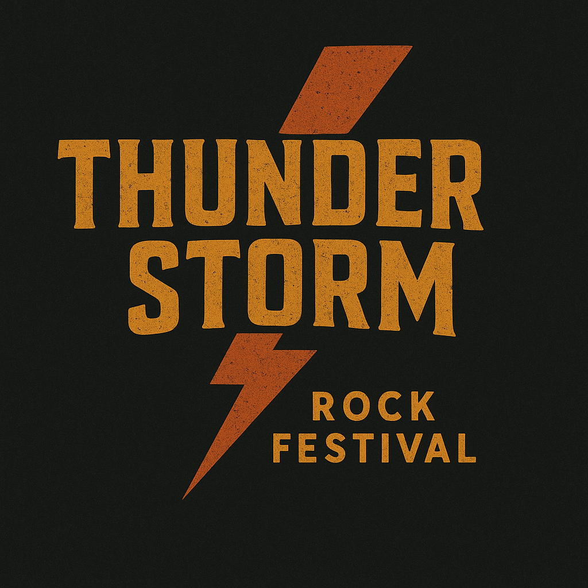

# 🎸 Thunderstorm Rock Festival 2025

Moderni web-pohjainen festivaalijärjestelmä PHP:lla ja MySQL:llä toteutettuna. Thunderstorm Rock Festival on kattava festivaalin hallintasovellus, joka sisältää käyttäjähallinnan, tapahtumailmoittautumiset, palautejärjestelmän ja admin-paneelin.

  

---

## 📋 Sisällysluettelo

- [Ominaisuudet](#-ominaisuudet)
- [Teknologiat](#-teknologiat)
- [Asennus](#-asennus)
- [Käyttöohjeet](#-käyttöohjeet)
- [Tietokantarakenne](#-tietokantarakenne)
- [Projektin rakenne](#-projektin-rakenne)
- [Tekijä](#-tekijä)

---

## ✨ Ominaisuudet

### Käyttäjille:
- 🎫 **Käyttäjärekisteröinti ja kirjautuminen**
  - Turvallinen salasanan hashays
  - Session-pohjainen autentikaatio
  
- 👤 **Profiilinhallinta**
  - Henkilötietojen päivitys
  - Salasanan vaihto
  - Omien tietojen hallinta

- 🎉 **Tapahtumailmoittautuminen**
  - Kolme lipputyyppiä: Päivälippu, Viikonloppulippu, VIP
  - Ilmoittautumisen peruutus
  - Ilmoittautumishistorian seuranta

- 💬 **Palautelomake**
  - Kategorioitu palaute
  - Sähköpostivahvistus
  - Yhteydenotto järjestäjiin

### Admineille:
- 🛠️ **Admin-hallintapaneeli**
  - Käyttäjähallinta
  - Tapahtumailmoittautumisten hallinta
  - Palauteviestien käsittely
  - Tilastot ja yhteenvedot

- 📊 **Raportit ja tilastot**
  - Ilmoittautuneiden määrä
  - Lipputyyppien jakautuminen
  - Palautestatukset

### Ulkoasu ja käyttökokemus:
- 🎨 **Rock-teemainen design**
  - Animoidut tausta-efektit
  - Gradienttipainikkeet
  - Hover-efektit

- 📱 **Täysin responsiivinen**
  - Toimii kaikilla laitteilla
  - Mobiiliystävällinen hampurilaismenu
  - Responsiiviset taulukot (kortit mobiilissa)

- ✨ **Animaatiot**
  - Hero-slideshow etusivulla
  - Fade-in efektit
  - Smooth scroll

---

## 🛠️ Teknologiat

**Backend:**
- PHP 8.x
- MySQL / MariaDB
- PDO (PHP Data Objects)

**Frontend:**
- HTML5
- CSS3 (Custom Properties, Flexbox, Grid)
- Vanilla JavaScript

**Turvallisuus:**
- Password hashing (bcrypt)
- Prepared statements (SQL injection prevention)
- Session management
- Input validation

## 👨‍💻 Tekijä

**Kari Markus**  
- Portfolio: [markar07.github.io/Portfolio](https://markar07.github.io/Portfolio/)

