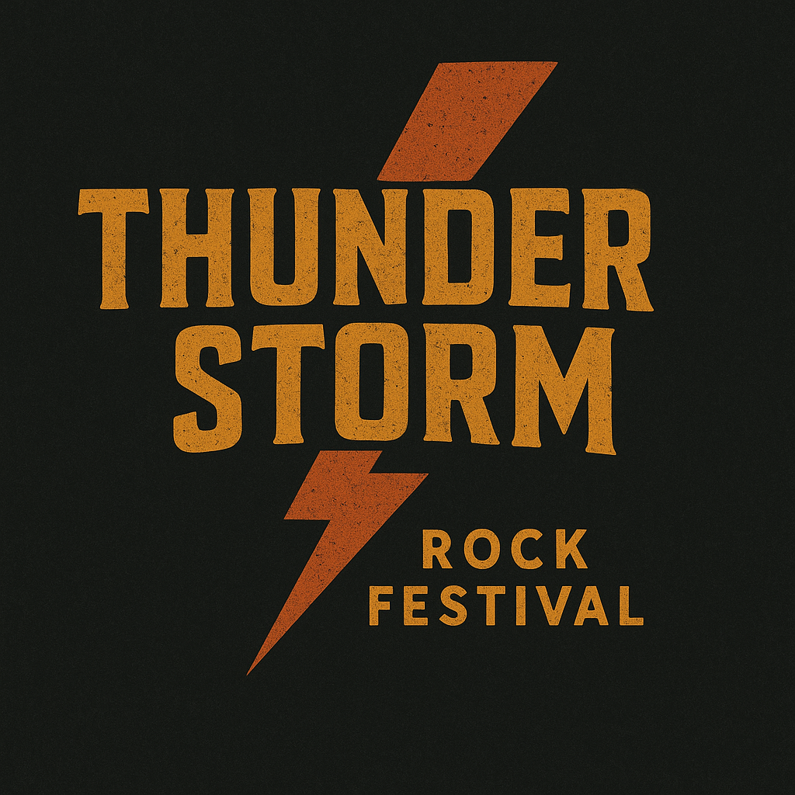

# 🎸 Thunderstorm Rock Festival 2025

Moderni web-pohjainen festivaalijärjestelmä PHP:lla ja MySQL:llä toteutettuna. Thunderstorm Rock Festival on kattava festivaalin hallintasovellus, joka sisältää käyttäjähallinnan, tapahtumailmoittautumiset, palautejärjestelmän ja admin-paneelin.

  

---

## 📋 Sisällysluettelo

- [Ominaisuudet](#-ominaisuudet)
- [Teknologiat](#-teknologiat)
- [Turvallisuus](#-turvallisuus)
- [Tekijä](#-tekijä)

---

## ✨ Ominaisuudet

### Käyttäjille:
- 🎫 **Käyttäjärekisteröinti ja kirjautuminen**
  - Turvallinen salasanan hashays (bcrypt)
  - Session-pohjainen autentikaatio
  - Salasanan palautus sähköpostilla
  
- 👤 **Profiilinhallinta**
  - Henkilötietojen päivitys
  - Salasanan vaihto
  - Tilin poisto
  - Omien tietojen hallinta

- 🎉 **Tapahtumailmoittautuminen**
  - Kolme lipputyyppiä: Päivälippu (35€), Viikonloppulippu (60€), VIP (120€)
  - Ilmoittautumisen peruutus
  - Ilmoittautumishistorian seuranta

- 💬 **Palautelomake**
  - Kategorioitu palaute
  - Yhteydenotto järjestäjiin

### Admineille:
- 🛠️ **Admin-hallintapaneeli**
  - Käyttäjähallinta (poisto)
  - Tapahtumailmoittautumisten hallinta
  - Palauteviestien käsittely (new/read/resolved)
  - Tilastot ja yhteenvedot

- 📊 **Raportit ja tilastot**
  - Ilmoittautuneiden määrä
  - Lipputyyppien jakautuminen
  - Palautestatukset

### Ulkoasu ja käyttökokemus:
- 🎨 **Rock-teemainen design**
  - Animoidut tausta-efektit
  - Hero-slideshow etusivulla
  - Gradienttipainikkeet
  - Hover-efektit ja animaatiot

- 📱 **Täysin responsiivinen**
  - Toimii kaikilla laitteilla
  - Mobiiliystävällinen hampurilaismenu
  - Responsiiviset taulukot (kortit mobiilissa)

- ✨ **Interaktiivisuus**
  - Toast-notifikaatiot
  - Scroll-to-top -nappi
  - Smooth scroll
  - Form validation shake
  - Ripple effect napeille

---

## 🛠️ Teknologiat

**Backend:**
- PHP 8.x
- MySQL / MariaDB
- PDO (PHP Data Objects)
- PHPMailer (sähköpostilähetys)

**Frontend:**
- HTML5
- CSS3 (Custom Properties, Flexbox, Grid, Animations)
- Vanilla JavaScript (ES6+)

**Turvallisuus:**
- Password hashing (bcrypt)
- Prepared statements (SQL injection prevention)
- CSRF protection (Cross-Site Request Forgery)
- XSS prevention (input sanitization & output escaping)
- Session management (timeout, regeneration, hijacking prevention)
- Rate limiting (login, registration, contact)
- Security logging

---

## 👨‍💻 Tekijä
Kari Markus

- Portfolio: markar07.github.io/Portfolio
- GitHub: @MarKar07
